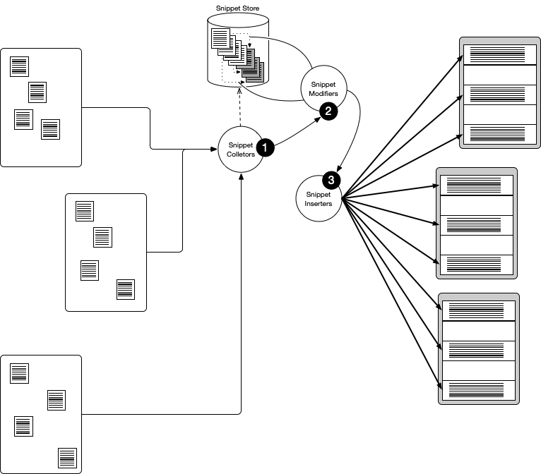

# Documentation Generation using SNIPPETS

## DEPRECATED

Docugen generator is discontinued.
The same result can be reached using the Jamal macro processor that is 

* architecturally more fir for the purpose
* has more features
* can be extended easier.

To (DO NOT) use docugen generators, add the following maven dependency to your project:

```xml
<dependency>
    <groupId>com.javax0.geci</groupId>
    <artifactId>javageci-annotation</artifactId>
    <version>1.5.0</version>
</dependency>
```

Software is as good as it is used.
Good and up-to-date documentation is needed for the use of software and to be honest: good documentation is rare.
There are many aspects to creating good documentation like good grammar, easy to understand sentences, up-to-date facts, examples in the documentation and many others.
Docugen code generator working inside the Java::Geci framework can help to keep the documentation up-to-date reducing redundancy.

Documentation is often redundant.
This is not a problem.
Documentation is not code.
When we read the documentation the information has to be consistent and has to be there where we actually are in the reading and understanding process.
Many times it means that the same text appears at different places.
It gets there using copy and paste.
Similarly, program documentation many times contains code examples.
Sometimes these examples are written by the document writer/editor (bad practice).
Other times, they are written by the programmers as example programs, and the editors only copy the code to the documentation.

Documentation has to follow the change of the code.
If the code changes the relevant (but only the relevant) parts of the documentation have to be updated.

If the copy-paste or update operations are performed each time the original text or the code changes then the documentation is up-to-date.
Usually, these operations, when done by a human are not performed, performed late or with mistakes.
The reason for this is that these are boring and mechanical tasks which humans are not good at.
The same time, computers can be asked to perform these tasks and this is what Java::Geci snippet handling does.

The different functions that the snippet handling provides were tested in a former application focusing on the documentation generation.
I wrote this tool in Python and tested it when I wrote the book Java Projects by Peter Verhas, second edition, PACKT, ISBN 978-1-78913-189-5.

## Using snippets

To have Java::Geci do these copy-paste operations the parts of the text, or code that needs to appear elsewhere has to be signaled.
This is done putting a special line containing

```
snippet snippet_name parameters
```

where the text starts and putting a special line containing

```
end snippet
```

after the last line of the text.
These two lines define a snippet.
The words `snippet` and `end snippet` are configurable in the code generator that collects the snippets.
I advise you against redefining it, because it makes your code less maintainable.
The word `snippet` can also be written as `snipet` if you happen to misspell the word `snippet`.

Snippets are essentially text lines.
Each snippet has a name and optionally has parameters.
The snippet collectors usually collect the lines from the sources recognizing the start and end lines.
For example, the class `SnippetCollector` collects the snippets with the start and end lines as described above.
It only requires that the line *contains* the word `snippet` with a name after it and (optionally) parameters.
This means that you can define your snippet in a Java comment, e.g.:

```
// snippet snippet_name

and / or

/* end snippet */
```


## Snippet handling generators

Many generators implement snippet handling logic.
These are not conventional generators in the sense that many of them do not generate code.
They, however, implement the `Generator` interface and thus work inside the Java::Geci framework, and can be configured the same way as many other generators.



There are three types of snippet handling generators:

- **Snippet collectors** that read the source files that the Java::Geci interface lists.
The snippets are collected into a `SnippetStore` object, which itself is stored in the context managed by the framework.
The `SnippetStore` object is available to all snippet handling generators using the same Geci object or by Geci objects that share the same context.
The `SnippetStore` can store a snippet and can also retrieve a snippet using its name.
This functionality is used by the snippet modifier generators.

- **Snippet modifiers** are generators that modify the already collected snippets.
There are snippet modifying generators that trim off the spaces on the left of the lines, perform search and replace on the lines using regular expression, delete certain lines from snippets, join different snippets together, number the lines and so on.
These snippet modifiers are controlled by the parameters of the source segments that use the actual snippet(s) and to let different segments to use the same snippet with individual modifications these generators create copies of the snippets they modify.
 
- **Snippet inserters** that insert the optionally modified snippets into the text where they are needed in different segments.
These are real generators in the sense that they modify the code, even if the code is documentation.
They do it the standard way Java::Geci supports writing segments and possibly failing the unit test when the documentation *was* not up-to-date.

Later in this document, we will write about the available snippet handling generators and how to use them.

## Snippet Strategy

Before getting into the details of the different snippet handling generators let's talk about the strategy on how to use snippets.

When the document contains sample code then it is fairly straightforward what a snippet is.
It is the code of the unit test, that plays the role of the documentation.
The code is inserted into the documentation as formatted code. 

There are parts of the document that are repeated.
It is also possible to have hyperlinks and references to the text, but many times it is better to repeat the text.
In this case, one part of the document can play the role of the snippet, and the other parts may be the segments where the snippet will be copied.
This approach needs a lot of discipline not to mix up the original snippet text and the copies.
Many times it is better to store these snippets in one, or many snippet files, which is not part of the documentation, and the documentation files all contain copies.

Another use of the snippets when part of the documentation has its natural place in the code itself.
A good example is the configuration parameters of the generators.
Generators usually have an inner class named `Config` with many fields.
When a new configuration parameter is inserted, deleted, or the use of it changes then this is more likely to update the documentation if it is attached directly to the field as a comment/snippet than if it is in a separate documentation file.
Although there is a high chance the comment, which is part of the documentation, will also be outdated as comments usually are outdated.
Even though, the chances are a slim better than in case of a separate documentation.

## Generator Phases

Code generators usually work alone without the aid of other generators.
Snippet handling generators are different.
They cooperate heavily.
In this case, it has the consequence that there has to be a specific order of how these generators are executed.
We cannot trim the lines of the snippets eliminating the tabbing on the left side of the lines if they were not collected yet.
Also, trimming is not possible when the lines were already numbered.
We need to perform these operations in a certain order.

In other cases, the ordering may not be so simple.
We may need to delete certain lines from a code sample and want to number the lines so that the text can reference the individual code lines in the explanation.
In this case, numbering comes after the deletion of certain lines.
A different code sample, however, needs to number the lines first and then delete the lines that we do not want in the documentation.
That way the deletion follows the numbering of the original lines in the code sample, and it clearly shows in the documentation that some lines were deleted.

The ordering of the execution of the generators is generally up to the framework, and it is not guaranteed, but generators can decide in which phase they want to run.
The framework executes the generators in multiple phases many times, and it consults each generator in each phase whether it needs execution in that phase or not.

Snippet handling generators need execution only in a single phase.
They can be configured during their creation (using the builder) which phase they should run.
If the line trimming should run before numbering then the generator `SnippetTrim` should have a smaller phase serial number than `SnippetNumberer`.
The snippet handling generator build up usually looks like the one that is used to create this documentation:

<!-- snip TestGenerateJavageciDocumentation trim="to=0"-->
```java
final var fragmentCollector = new Geci();
fragmentCollector
    .source(Source.maven().module("javageci-tools").mainSource())
    .source(Source.maven().module("javageci-core").mainSource())
    .source(Source.maven().module("javageci-docugen").mainSource())
    .register(FragmentCollector.builder()
        .param("configVariableName").regex("\\w+\\s+.*?(\\w+)\\s*=")
        .param("configDefaultValue").regex("=\\s*\"?(.*?)\"?;")
        .build())
    .generate();

final var geci = new Geci();
Assertions.assertFalse(
    geci.context(fragmentCollector.context())
        .source("..", ".")
        .ignoreBinary()
        .ignore(
            "\\.git", "\\.idea", "\\.iml$",
            "javageci-livetemplates", "target")
        .log(Geci.MODIFIED)
        // outdated registration of the document generators, see the real example in the documentation below
        .register(SnippetCollector.builder().files("\\.md$|\\.java$|\\.adoc$")
            .phase(0).build())
        .register(SnippetAppender.builder().files("\\.md$|\\.java$|\\.adoc$")
            .phase(1).build())
        .register(SnippetTrim.builder().files("\\.md$|\\.java$|\\.adoc$")
            .phase(2).build())
        .register(SnippetNumberer.builder().mnemonic("prenumber").files("\\.md$|\\.java$|\\.adoc$")
            .phase(3).build())
        .register(SnippetRegex.builder().files("\\.md$|\\.java$|\\.adoc$")
            .phase(4).build())
        .register(SnippetLineSkipper.builder().files("\\.md$|\\.java$|\\.adoc$")
            .phase(5).build())
        .register(SnippetNumberer.builder().files("\\.md$|\\.java$|\\.adoc$")
            .phase(6).build())
        .register(MarkdownCodeInserter.builder()
            .phase(7).build())
        .register(JavaDocSnippetInserter.builder()
            .phase(8).build())
        .splitHelper("adoc", new AdocSegmentSplitHelper())
        .splitHelper("md", new MarkdownSegmentSplitHelper())
        .splitHelper("java", new JavaDocSegmentSplitHelper())
        .generate(),
    geci.failed());
```

The generators are registered in the order they are to be executed and the calls to `phase(0)`, `phase(1)` ...  register the phases 0, 1, 2 ... and so on.

There is another possibility to have the generators executed the appropriate order.
You can create several execution environment (Geci objects) and then invoke `generate()` on those one after the other.
To share the context between these objects you can use the method `context()` either without argument to retrieve the context of the Geci object or with argument to set the context.

It is recommended, however, to use the phased execution because that way the directory parsing, and the collection of the files to work on is executed only once.
This type of ordering support is implemented in the convenience class `javax0.geci.docugen.Register` that implements methods that help registering all the docugen generators in their usual order.
Using that class the eight calls to the `.register()` method can be replaced with one single call as the following: 

<!-- snip RegisteringAllSnippets snippet="RegisteringAllSnippets" 
          trim="to=0"
                 -->
```java
.register(Register.allSnippetHandlers())
```

This call will register the 

<!-- snip A0FE5632374 snippet="List_of_All_Generators_in_Register" 
          regex="replace='|.builder~(~),?.*||' replace='|^~s*|1. |' escape='~'"
          trim="to=0"
                 -->
1. SnippetCollector
1. SnippetAppender
1. SnippetTrim
1. SnippetNumberer
1. SnippetRegex
1. SnippetLineSkipper
1. SnippetNumberer
1. MarkdownCodeInserter
1. JavaDocSnippetInserter
<!-- end snip -->

You can see that the generator `SnippetNumberer` is listed twice.
The method registers two different instances of this generator.
The first one is instantiated setting the mnemonic to "`prenumber`" (4).
The second one uses the default mnemonic "`number`" (7).
That way it is possible to number something before the regular expressions and the line skipping are handled.
That is feasible when we want line numbering that shows that some lines are not displayed in the snippet. 

The actual unit test that executes the document generation for Java::Geci is using this form, but you can also find the old, more verbose version in the unit test file with commented-out `@Test` annotation.

In the example above the Geci object `fragmentCollector` is created and used separately to collect the documentation fragments from the Java files only.
It could be executed together with the other generators in the phase 0, but in that case it would try to collect the documentation fragments from all the files.
As it is now the object `fragmentCollector` collects the documentation fragments only from the Java files of the module `javageci-docugen`. Retrieving the context built up by this object and injecting into the next one will transfer the collected snippets inside the context for the next generators.

# Implemented Snippet Handling Generators

As there are three types of snippet handling generators we will discuss the implemented generators in three subsections.

## Collectors

### `SnippetCollector`

The generator `SnippetCollector` is executed by the framework for all sources that are configured and collected, and the collector scans through the lines of the sources and collects the snippets.

It starts to collect lines after a line that matches the regular expression named `snippetStart` and before `snippetEnd`.
These regular expressions have default values and as they are listed in the `Config` inner class of the generator `SnippetCollector`:

<!-- snip SnippetCollector_config trim="to=0" regex="replace='/snippetEnd/snippetEnd  /' replace='/private Pattern//' replace='/~);//' replace='/Pattern.compile~(//' escape='~'"-->
```java
 snippetStart = "(?://|/\\*)\\s*snipp?et\\s+(.*)$"
 snippetEnd   = "(?://\\s*end\\s+snipp?et|end\\s+snipp?et\\s*\\*/)"
```

The characters that follow the `snippet` to the end of the line are parameters.
Syntactically they are the same as the parameters in the `@Geci` annotations or in the editor-fold segments.
The first word is the name/id of the snippet the rest are parameters.
The snippet is stored using the name and this name is used when later the snippet is referenced in the text that needs the snippet to be inserted.
The parameters are stored along with the snippet and are available for snippet modifying and snippet inserting generators.

### `FragmentCollector`

The fragment collector was designed to collect documentation fragments from Java source files.
It is easier to use a bit than the general purpose snippet collector to collect documentation fragments that are not code samples.
The collected snippets start with a line that has a star `*` and a dash `-` character with optional space between them (this is usually inside some code JavaDoc fragment) and end with the end of the comment, which is `*/` on its own line.
The regular expression patterns matching the start and the end of the snippets are configurable in the builder of the generator.
There is also a configurable transformation, which is applied to each line before appending to the snippet.
The default values are fitting Java:

<!-- snip FragmentCollector_config trim="to=0" 
                                   regex="replace='/snippetEnd/snippetEnd  /' 
                                          replace='/private (?:Pattern|Function<.*?>)//'
                                          replace='/(~$)\"~);/$1\"/' 
                                          replace='/Pattern.compile~(//' 
                                          escape='~'"-->
```java
 snippetStart = "^\\s*\\*\\s*-(?:\\s+(.*))?$"
 snippetEnd   = "^\\s*\\*/\\s*$"
 transform = line ->
    line.replaceAll("^\\s*\\*\\s?","")
    .replaceAll("^\\s*</?p>\\s*$","");
```

The regular expression capture group after the `*-` can specify part of the name of the snippet.
In the code this part of the name is called sub-name.
The full name of the snippet is calculated automatically using the following format:

    FileName_subName_nnnnnn

where `FileName` is the name of the file without the path or the extension.
In case of Java classes this is the name of the top-level class defined in the file.
`subName` is either empty string (default value), or the last sub-name defined in the file.
`nnnnnn` is a six character counter, that starts with 1 every time when a new sub-name is defined.

Using this automatic naming you can refer to the segments joining them together and can have the comments contain the documentation in strong cohesion of the actual code without individually naming them in the source code.

Although it is possible to have the default empty string as a sub-name it is recommended to define a sub-name in every file that contains documentation fragments to be collected by `FragmentCollector`.
If there is no sub-name defined then there will be two underscore characters between the `FileName` and `nnnnnn` part.

There is transformation is applied on each line of the snippet.
The default is to remove all spaces, the `*` character and optionally a space after that.
When a line does not start with `*` character (after the spaces) then this default transformation will not touch it.
Also, only one space is removed after the `*` character so that indentation and code fragments that are indented in markdown are not ruined.

In addition to this transformation the collector collects the line after the snippet to extract characters out of it.
In the configuration you can specify several 

```java
.param("parameterName").regex("regular expression pattern with a single (capture group)")
```

parameters.
The line after the snippet is matched against the regular expression and in case it matches and there are at least one capture group captured then the captured character will replace the `{{parameterName}}` placeholder on each and every line of the snippet.

This transformation can be used to avoid the copy/paste of the variable names, values etc. that is defined in the code.
In case a variable is renamed, a value is changed the documentation will be automatically updated.

## Modifiers

Snippet modifiers run when the snippets are collected and modify the lines of the snippets.
Because the same snippet may be used with different modifications for different segments modifiers create a copy of the snippet before any modification is performed.
The copy is assigned to the segment where the snippet will be inserted.

### Snippet Store and Snippet Copies

Keeping track of the copies is automatically done by the snippet store.
The snippet store stores the original snippets as they are collected, and the copies that are identified by the name of the snippet and by the id of the segment.

For example, the snippet named `SnippetCollector_config` is used a few lines above, and the use is configured to perform certain modifications.
Namely, these are trimming, and replacing declaration clutter (types, modifiers and so on) that is important in the Java code but distracts in the documentation.
We can insert the same snippet without any modifications again:

<!-- snip SnippetCollector_config_other snippet="SnippetCollector_config"-->
```java
        private Pattern snippetStart = Pattern.compile("(?://|/\\*)\\s*snipp?et\\s+(.*)$");
        private Pattern snippetEnd = Pattern.compile("(?://\\s*end\\s+snipp?et|end\\s+snipp?et\\s*\\*/)");
```

### Segments for Snippets

The snippets are inserted into segments like any other generated code.
These segments, however, are usually not editor-fold segments.
Editor fold segments are useful for Java code, but are not useful for markdown or other documentation format.
When the framework Java::Geci is searching the segments in source codes it uses segment split helpers.
These helper classes can give hints to the framework in the process splitting up a source into segments.
The one that supports splitting up Java source code is automatically configured.
Segments that are for other formatted files have to be registered.
If we look again at the code that is used to create this documentation:
                                                          
<!-- snip splitHelperRegistering snippet="TestGenerateJavageciDocumentation" trim="to=0" number="do"-->
```java
1. final var fragmentCollector = new Geci();
2. fragmentCollector
3.     .source(Source.maven().module("javageci-tools").mainSource())
4.     .source(Source.maven().module("javageci-core").mainSource())
5.     .source(Source.maven().module("javageci-docugen").mainSource())
6.     .register(FragmentCollector.builder()
7.         .param("configVariableName").regex("\\w+\\s+.*?(\\w+)\\s*=")
8.         .param("configDefaultValue").regex("=\\s*\"?(.*?)\"?;")
9.         .build())
10.     .generate();
11. 
12. final var geci = new Geci();
13. Assertions.assertFalse(
14.     geci.context(fragmentCollector.context())
15.         .source("..", ".")
16.         .ignoreBinary()
17.         .ignore(
18.             "\\.git", "\\.idea", "\\.iml$",
19.             "javageci-livetemplates", "target")
20.         .log(Geci.MODIFIED)
21.         // outdated registration of the document generators, see the real example in the documentation below
22.         .register(SnippetCollector.builder().files("\\.md$|\\.java$|\\.adoc$")
23.             .phase(0).build())
24.         .register(SnippetAppender.builder().files("\\.md$|\\.java$|\\.adoc$")
25.             .phase(1).build())
26.         .register(SnippetTrim.builder().files("\\.md$|\\.java$|\\.adoc$")
27.             .phase(2).build())
28.         .register(SnippetNumberer.builder().mnemonic("prenumber").files("\\.md$|\\.java$|\\.adoc$")
29.             .phase(3).build())
30.         .register(SnippetRegex.builder().files("\\.md$|\\.java$|\\.adoc$")
31.             .phase(4).build())
32.         .register(SnippetLineSkipper.builder().files("\\.md$|\\.java$|\\.adoc$")
33.             .phase(5).build())
34.         .register(SnippetNumberer.builder().files("\\.md$|\\.java$|\\.adoc$")
35.             .phase(6).build())
36.         .register(MarkdownCodeInserter.builder()
37.             .phase(7).build())
38.         .register(JavaDocSnippetInserter.builder()
39.             .phase(8).build())
40.         .splitHelper("adoc", new AdocSegmentSplitHelper())
41.         .splitHelper("md", new MarkdownSegmentSplitHelper())
42.         .splitHelper("java", new JavaDocSegmentSplitHelper())
43.         .generate(),
44.     geci.failed());
```

we can have a look at line 14.
It registers the `MarkdownSegmentSplitHelper` class and associates it with the file extension `md`. (We could also write `.md`.)
For files that have the extension `.md` this segment split helper will be used.
For everything else, the default Java segment split helper.

The way segment split helpers work is that they can tell where a segment starts and where it ends.
Most of the helpers (as a matter of fact both of them that have been developed so far) are based on regular expression matching.
The `MarkdownSegmentSplitHelper` defines the following regular expression patterns:

<!-- snip MarkdownSegmentSplitHelper_patterns 
              skip="do"
              trim="do" 
              regex="replace='/e_n/en/'
                     kill='Pattern~.compile'
                     escape='~'
                     "-->
```java
                //startPattern
                        "^(\\s*)\\[//]:\\s*#\\s*\\(\\s*snip\\s+(.*)\\)\\s*$" +
                                "|" +
                                "^(\\s*)<!--\\s*snip\\s+(.*)-->\\s*$"
                // endPattern
                        "^(\\s*)```(\\s*)$" +
                                "|" +
                                "^(\\s*)\\[//]:\\s*#\\s*\\(\\s*end\\s+snip\\s*(.*)\\)\\s*$" +
                                "|" +
                                "^(\\s*)<!--\\s*end\\s+snip\\s*(.*)-->\\s*$"
```

This shows that in the case of markdown the segments can start with an HTML comment that contains the word `snip` at the start and followed by the segment parameters, or it can be a special

```
 []: # (snip ...) 
 ```

line which is a weird hack in markdown and will not get into the HTML output and generally can be used as a comment.

The `MarkdownSegmentSplitHelper` can also collect consecutive lines in case the segment starting HTML comment is multiline.
This way you can write:

    <!-- snip SampleMultlineSnippet snippet="epsilon" 
              regex="replace='/^~s*~*~s?//' 
                     escape='~'"-->
    <!-- end snip -->
    
This is convenient when there are many regular expression, trimming and other parameters for the snippet.
The lines are joined together first and are analyzed to get the parameters after that so it is not a problem if you insert a new line inside a parameter string.
The new-line character will be removed, but the spaces at the end and at the start of the lines not.
In the example above the string after the parameter `regex` spans two lines.
When these are joined the parser wil process it as:

```
regex="replace='/^~s*~*~s?//'                     escape='~'"-->
```

with the many spaces before the parameter `escape`.
    
The end of a segment is either three backticks, or an HTML comment, or a markdown comment (as the example shows above) that contain the words `end snip`.
It is important to note that the `MarkdownCodeInserter` generator that inserts the code into the segments look at the first line of the segment that is already there and in case it starts with three backtick then it keeps that line and modifies only the rest of the lines writing the content of the snippet there.

The segment that starts with `snip` and is followed by the parameters should have an id.
This id is either specified as the first word on the line after the word `snip` or it is the value of the parameter `id`.
The snippet that is to be used in this segment is specified using the parameter `snippet`.
In case there is no parameter named `snippet` then the id of the segment will be used.
The segments that are used to accommodate snippets have to be uniquely named.
Although it is absolutely fine to have segments with the same name in different source files when we generate code into Java programs the snippet handling may get confused.
If two different segments share the same name even in different files and use the same snippet then they will share the same copy of the snippet.
All the modifications done by one of the uses will also affect the use of the snippet in the other segment.
As a rule of thumb: segments using snippets have to be uniquely named.
If more than one segment uses the same snippet then only one can use the name of the snippet as segment id, the others should have different identifiers and refer to the snippet using the `snippet` parameter.

### Invocation of Modifiers

A snippet modifying generator runs only if it is registered in the Geci execution for the appropriate phase and only for the segments that configures the execution of that modifier.

Each snippet modifier generators has a mnemonic.
The use of this mnemonic is a bit different than in case Java code generators, but on a high level, it is very similar.
It is a word that identifies the generator.

When the segment has a parameter, which is the mnemonic of the generator then the generator will be executed for that segment, and it will execute the modifications it has to perform on the segment copy of the snippet.

The format of the parameter with the mnemonic is the same as the format of the parameter lines of the segment.
The first word can be the id of the configuration (this is optional and usually not used), and the rest is `key=value` pairs.
Note that these `key=value` pairs are already inside a string thus the `"` character has to be quoted in case `"` was used to enclose the parameter itself.
For example the snippet insertion above in the markdown code looks like the following:

    snip MarkdownSegmentSplitHelper_patterns skip="do" trim="do" regex="replace='/e_n/en/'"

The identifier of the segment is `MarkdownSegmentSplitHelper_patterns` and this is also the name of the snippet it uses.
The snippet when collected contains some lines that we do not need in the documentation, therefore, the generator with the mnemonic `skip` is used.
Also, the lines have to be trimmed therefore `trim` is also configured. 
As a matter of fact, the skipper generator does not need many configurations, and the trimming generator is invoked using the default parameters.
In this case, we just write "do" as a configuration string. In that case, the id of the configuration is `do` and this is generally ignored.

It is important that in case a snippet modifier is to be executed but does not need configuration then it cannot just be configured with the empty string.
For example `trim=""` will not run the trimmer.
The empty string means that the modifier is not configured to run.

The generator with the mnemonic `regex` is configured with one parameter.
This parameter is `replace` and it will instruct the generator to replace every occurrence of `e_n` to `en`. 
It is only there for demonstration purposes only, there is no `e_n` in the actual snippet.

### Configuration for all Snippet Modifiers

The following configuration options are available for all the snippet modifiers.
These configuration options are defined in the abstract class `AbstractSnippeter`, which is extended by every snippet modifier class and thus they inherit these configuration options.
The other configuration options that are specific to an individual snippet modifier are detailed separately for each.

<!-- snip AbstractSnippeter_configuration 
              snippet="epsilon" 
              trim="to=0" 
              append="snippets='AbstractSnippeter_config_.*'" 
              regex="replace='/protected~s~w+~s/##### `/'
              replace='/;.*$/`/' 
              replace='|^~s*/~*||' 
              escape='~'" skip="do"-->
#### `phase = 1`


The phase parameter defines the phase that the snippet modifying generator is to be run.
As this is not a `String` parameter it can only be configured in the builder when the generator instance is created.
The generator will return the value `phase + 1` when the framework queries the number of phases the generator needs and when asked if it has to be active in a phase it will return `true` if the actual phase is the same as the one configured.

#### `files = "\\.md$|\\.adoc$"`


This configuration parameter can limit the file name pattern for which the snippet generator will run.
The default value is to run for every file that has the extension `.md` or `.adoc`.
If you have other file extensions in your documentation you can configure it in the builder interface.

<!-- end snip -->

### Snippet Modifiers

In this section, we document the individual snippet modifiers one by one.

#### Trim

Trim is implemented in the generator class `SnippetTrim`.
It can remove the spaces from the left of the lines keeping the original tabbing.
When a snippet is collected from some deeply nested code structure then it usually happens that each line starts with many spaces.
This would push the code in the documentation to the right leaving a huge gutter on the left.
This modifier removes the extra spaces.

The configuration parameters are the followings:

<!-- snip SnippetTrim_config snippet="epsilon" 
                             trim="to=0" 
                             skip="do"
                             append="snippets='SnippetTrim_config_.*'" 
                             regex="replace='/private~s~w+~s/##### `/' 
                                    replace='/;.*$/`/' 
                                    replace='|^~s*/~*||' 
                                    escape='~'" 
                             -->
##### `to = "0"`


This parameter can define the number of spaces on the left of the lines.
Although the parameter is a string the value should be an integer number as it is recommended to specify it without `"` or `'` characters surrounding, just simply, for example

    trim="to=2"

<!-- end snip -->

#### Regex

<!-- snip SnippetRegex_doc_000001 -->

The `regex` snippet generator goes through each line of the snippet and does regular expression based search and replace and it also deletes certain lines that match a regular expression kill pattern.

It can be used for example as

     regex="replace='/a/b/' kill='abraka'"

to replace each occurrence of `a` to `b` and the same time delete all lines from the snippet that contains `abraka`.

A real life example is:

     regex="replace='/^\\\\s*\\\\*\\\\s?//'

It was used in the documentation of DOCUGEN.md to include the snippet defined in the JavaDoc of the class `SnippetRegex` and to remove the `*` characters from the start of the line.
The result is what you are reading now (or you may be reading the original JavaDoc in the Java file.)

The replace configuration string should have the syntax

    W + search string + W + replace string + W

where `W` is just any character.
It is usually `/` so that the search and replace string looks like the usual vi editor search and replace.

When we write regular expressions inside the `replace` string it is interpreted as a Java string already twice.
This means that the escape characters used in regular expressions as well as in strings, the backslash characters had to be repeated four times.
This would greatly decrease readability.
Instead of `\s` we could write `\\\\s`. (As a matter of fact it is a possibility.)

To lessen the number of backslash characters and to avoid building `\\\\\\` fences instead of coding it is possible to define a character that is used instead of `\` in the regular expressions.
The configuration parameter is `escape` and you can write on a segment line

    regex="replace='/^~s*~*~s?//' escape='~'

to use the tilde character instead of

    regex="replace='/^\\\\s*\\\\*\\\\s?//'

The recommendation is to use the tilde characters.
There can only be one `escape` definition in a single segment, but there can be many `replace` strings and they will be executed in the order they are defined.

Note that the default escape string is a string and not only a single character, but it does not really make sense to use many characters when the major aim of this configuration is to shorten the regular expression escape sequences.

If you want to use the same escape string in all the snippet regex modifications then you can configure it in the builder when the regex snippet modifier generator object is created.

It is to note that by default the replacements are performed on each line and then the code decides if the line has to be killed or not.
You can reverse this order using the configuration

    killFirst=true

on the segment header.
If there is a need for this parameter it is a smell that something is overcomplicated in the use of the snippets.

<!-- end snip -->

#### Number

<!-- snip SnippetNumberer_doc regex="replace='/^~s*~*~s?//' escape='~'"-->

The `number` snippet handling generator is implemented in the class `SnippetNumberer`.
It can number the individual lines in a snippet with increasing numbers.
The result can be used to have some code with line numbers so that the surrounding text can reference the actual lines.

<!-- end snip -->


The configuration parameters for the numberer:

<!-- snip SnippetNumberer_config snippet="epsilon" trim="to=0" append="snippets='SnippetNumberer_Config_.*'" regex="replace='/private~s~w+~s/##### `/' replace='/;.*$/`/' replace='|^~s*/~*||' escape='~'" skip="do"-->
##### `start = "1"`

This is the number that will be used to denote the first line.
The default is to start from one and to use increasing numbers.

##### `step = "1"`

This configuration parameter controls the increment between the consecutive numbers.
If you want to number the lines in step of ten, like we did old times in BASIC then you can set `number="step='10'"`.

##### `format = "%d. "`

This configuration option controls how the numbers are formatted.
This is the string that is passed to the `String.format()` method as first argument when converting the line number to string.

##### `from = "0"`

When not all the lines are needed to be numbered in a snippet you can limit the numbering to start at certain line and finish at another line.
This parameter can specify the index of the first line that is to be numbered.
The default value is zero, which means that the very first line already will be numbered.
If you want to number starting with the second line then you can use `number="from=1"` as a configuration.
If you want to number only the last three lines then you can configure the generator on the segment providing the parameters `number="from=-3"`.

##### `to = ""`

You can limit the end of the numbering.
This parameter defines the index of the last line that is numbered exclusive.
If you want to number only the first three lines you can configure the generator as `number="to=3"`.
That way only the lines with the indexes `0`, `1` and `2` will be numbered.

Negative numbers, just as in case of `from` count backward from the end of the snippet.
Empty value, which is the default means no limit.

<!-- end snip -->

#### Append
<!-- snip SnippetAppender_doc regex="replace='/^~s*~*~s?//' escape='~'"-->

Snippet appender can be used to append multiple snippets together.
This is useful when the content of the documentation is in different places and it would be inconvenient to include the individual snippets one by one into the documentation.
The snippets can be referenced using their name and the reference can also contain regular expression.
In that case all the snippets that match the regular expression will be joined together and added to the actual snippet in alphabetical order.

The generator has one configuration parameter `snippets` (note the plural) that should list the snippets that are to be appended to the original snippet.
Remember that the base snippet is referenced in the segment using the parameter `snippet` or using the name of the segment id as a snippet name by default and the appended snippets are appended to this snippet.

There can be multiple `snippets` values on the configuration of the snippet appender.
They are worked up from left to right and when a value matches many snippet names as a regular expression then these snippets will be appended in alphabetical order.
The usual practice is to name these snippets something like `snippetName_001`, `snippetName_002` and so on and use the configuration `append="snippets='snippetName_.*'"`.

The regular expressions sometimes may need escaping and the same way as in case of the snippet modifying generator `regex` there is a parameter `escape` that can be used to specify the character that is used instead of `\\\\`.

Sometimes there is no base snippet to append to.
The documentation, for example, needs to join together the snippets `manySniipets_.*` that are `manySniipets_001`, `manySniipets_002`, and `manySniipets_003`.
In that case if the segment references the first snippet, `snippet="manySniipets_001" append="snippets='manySniipets_.*'"` then the first snippet will be copied twice.
For this reason there is a predefined snippet in the snippet store called `epsilon` that contains no lines.
Using that we can write

snippet="epsilon" append="snippets='manySniipets_.*'"

The snippets are copied from the original, unmodified version of the snippet.
It is not possible to execute modifications on the different snippets and perform the appending afterwards.

<!-- end snip -->

<!-- snip SnippetAppender_config snippet="epsilon" trim="to=0" 
                                 append="snippets='SnippetAppender_Config_.*'"
                                 regex="replace='/private~s(?:~w+|List<String>)~s/##### `/' 
                                        replace='/;.*$/`/' 
                                        replace='|^~s*/~*||' 
                                        escape='~'"
                                        -->
##### `snippets = Collections.emptyList()`

This configuration parameter defines the snippets that are appended to the base snippet.

##### `escape = ""`

This parameter can be used to define an escape character / string that can be used instead of the backslash character that would be needed four times to be used in the regular expression.
It is recommended to use the tilde `~` character.

<!-- end snip -->


#### Skip

<!-- snip SnippetLineSkipper_doc regex="replace='/^~s*~*~s?//' escape='~'"-->

 The `skip` functionality is implemented in the class `SnippetLineSkipper`.
 This generator can remove certain lines from a snippet that are denoted to be removed.
 Many times some code segment contains lines that are not necessarily in the documentation and may distract the reader from the important points of the code.
 For example you want to include a whole Java class into the documentation and you believe that the `import` statements are not that important.
 In such cases the snippet may contain some lines that the `SnippetLineSkipper` will recognize and remove the lines indicated.
 There are three different possibilities.

 The first one is to signal the start and the end of the lines to be removed like

        // skip
        import javax0.geci.annotations.Geci;
        import javax0.geci.api.CompoundParams;
        import javax0.geci.api.Segment;
        import javax0.geci.api.Source;

        import java.util.ArrayList;
        import java.util.regex.Pattern;
        // skip end

The skipper will remove the lines `// skip`, `// skip end` and also the lines between.

The second possibility is to write

        // skip N lines

The number `N` has to be a positive decimal number and the following `N` lines plus the `// skip N lines` will also be deleted.

The third possibility is to write

       // skip till regexp

that will delete this line and all following lines until there is a line that matches the regular expression.

The generator will work only for segments that has the configuration parameter `skip="do"` with non zero length string value.
There is only one configuration possibility.
If the value of the `skip` parameter on the segment is `remove` (a.k.a. the segment contains the `skip="remove"` parameter) then only the lines that are instructions for the line skippings are removed.
In any other cases the line removing is performed as described above.

In the generator builder the regular expression patterns that match `skip`, `skip end` and so on are configurable.

<!-- end snip -->

<!-- snip SnippetLineSkipper_config snippet="epsilon" 
                                   trim="to=0" 
                                   append="snippets='SnippetLineSkipper_Config_.*'" 
                                   regex="replace='/Pattern~.compile~(//' 
                                          replace='/private~sPattern~s/##### `/' 
                                          replace='/~);.*$/`/' 
                                          replace='|^~s*/~*||'
                                          escape='~'"
                                          -->
##### `skip = "skip"`

This pattern defines the line that starts the skipping and which skipping is finished by the pattern configured using the next configuration option `skipEnd`.

##### `skipEnd = "skip\\s+end"`

This pattern defines the line that stops line skipping in case it was started using a line matched by the previous pattern `skip`.

##### `skipNrLines = "skip\\s+(\\+?\\d+)\\s+lines?"`

This pattern finds the line that signals that a certain number of lines should be skipped.
If configured other than the default then the regular expression MUST have a single matching group (the part between the parentheses) that will match a substring that is a positive decimal number.

##### `skipTill = "skip\\s+till\\s+/(.*?)/"`

This pattern finds the line that is the start of skipping specifying a regular expression that should match a later line, which will be the stopping signal for skipping.
The line that matches the regular expression at the end will NOT be included in the snippet.
It will be skipped.

If configured other than the default then the regular expression MUST have a single matching group (the part between the parentheses) that will match a substring that will be used as a regular expression to find the skipping end.

<!-- end snip -->

### Snippet Inserters

The snippet inserters insert the snippets after they got their final content into the segments that refer to them.
Since different formats may need different syntax for segment start and finish there are different snippet inserting generators for different formatted files.

The snippet inserting code generators should run after the other generators.
It can be configured in the test so that they are active in the last phase.
Another approach is to execute them in a different Geci object that gets the snippets through context insertion.

#### Markdown Snippet Insertion

To insert snippet into a markdown formatted file the `MarkdownCodeInserter` can be used.
This generator has no configuration options.
The only speciality of this snippet inserting generator is that it looks at the original content of the segment and in case the first line starts with three backticks then it keeps this line as the first line of the segment and appends the lines of the snippet after this line.

That way it is possible to include a verbatim code sample, keeping the starting backticks that formats markdown code fragment and to use the closing backticks as segment closing.

# Sample

A documentation is several words and explanations but understanding is usually best via examples.
In this case the best example of the use of the snippets is the source code of this documentation itself `DOCUGEN.md`.
The snippets from the document generating code was extensively used in this document and it is also used in a careful and explanatory way that can be used to understand the use of the snippet handling generators.
