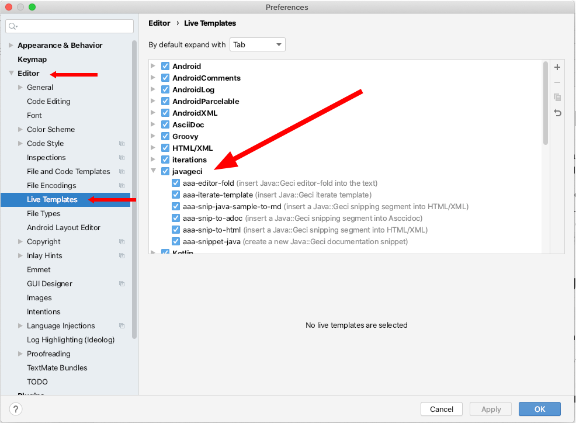

# IntelliJ live templates and Java::Geci

In IntelliJ you can use live templates to insert common constructs into your code.
There are a lot of built-in/preconfigured templates in IntelliJ and there are some live templates supported by Java::Geci.

These live templates that are help the use of some generators are in the project directory `javageci-livetemplates`.
To use them you can download the files from this directory and then install them into IntelliJ.
When they are installed you can get to them using the `Command + Alt + j` key combination on MacOS or `Control + Alt + j` key combination on Windows.


## Importing the live templates

Choose `File | Manage IDE Settings | Import Settings` from the menu.

Specify the path to the archive with the exported live template configuration.

The directory contains only the export of the live templates thus it is supposed to leave other settings intact.

After restarting IntelliJ IDEA, you will see the imported live templates on the `Editor | Live Templates` page of IntelliJ IDEA settings.



## Defined Java::Geci Live Templates

In this section we list the live templates in case you want to copy/paste some of the templates or want to modify and for some reason you do not want to import them directly from the `javageci-livetemplates` directory.

> Notes 
>
> (1) In addition to the id, description and the text of the template there are variables that are not included here.
> They can be set according to your taste and/or you can look at them in the file `javageci-livetemplates/templates/javageci.xml`.
>
> (2) Some templates contains Markdown verbatim text start and end markup, which cannot be properly presented in this file because this documentation file is also Markdown.
> In that case I modified the template text in this documentation.
> I inserted spaces between the backtick characters.
> If you happen to copy/paste such a template from here, then delete these extra spaces.

To insert a template you have to select some text or just press `Command + Alt + j` key combination on MacOS or `Control + Alt + j` key combination on Windows.
It will open a context sensitive menu listing the templates that are usable in the given context.
The templates are all named with the `aaa-` prefix so that they are listed at the start.
If you do not want this, then simply name them differently.

In newer IntelliJ releases or settings simply start to type `aaa` and the editor will immediately list in a pop-up box the possible templates.

### insert Java::Geci editor-fold into the text

Use this template to insert an editor fold into a Java source file.

Abbreviation: `aaa-editor-fold`

```
//<editor-fold id="$id$">
//</editor-fold>
$END$
```

### insert Java::Geci iterate template

Use this template to insert an iterate TEMPLATE into the source code.
The inserted ITERATE template is a Java comment that contains all the possible commands that are available in such a template.
The `SEP1` and `SEP2` lines define the separators and the default value in the live template is the value, which is the default value for the iterate TEMPLATE.
In case you just want to use thos you can delete the `SEP1` and `SEP2` lines and you have to keep those lines if you set the separator values to something different from the default.

The created sample template also contains sample LOOP command, and the default EDITOR-FOLD-ID that can also deleted if the default value is used.

The content in the `editor-fold` segment is a Java comment that describes the use of the iterator as a gentle remainder.
When the actual template content is edited and the generator is executed this comment will automatically be deleted by the generator and replaced by the generated iterated content.

Abbreviation: `aaa-iterate-template`

```
/*TEMPLATE
ESCAPE
    // this line is not interpreted as a command
SKIP
    // this line does not get into the template
SEP1 $sep1$
SEP2 $sep2$
LOOP field,type=birth$sep1$Date$sep2$name$sep1$String$sep2$age$sep1$int
EDITOR-FOLD-ID $editorfoldId$
    $templateContent$$END$
*/
//<editor-fold id="$editorfoldId$">
/* THIS WILL BE DELETED BY THE CODE GENERATOR, DON'T WORRY
 have at least one editor-fold named 'iterate' or
 annotate the class with @javax0.geci.core.annotations.Iterate
 default value for SEP1 is , if your use this you can delete the SEP1 line
 default value for SEP2 is | if your use this you can delete the SEP2 line
 you can have many loop lines, just have the same names before the =
 a single line after ESCAPE will be in the template even if it is a SEP1, SEP2, LOOP or EDITOR-FOLD-ID line
 a single line after SKIP will be skipped altogether
 */
//</editor-fold>
```

### insert a Java::Geci snipping segment into HTML/XML

This template inserts a Java snip into the code using HTML/XML comment.
It can be used in HTML/XML based documents (e.g.: Markdown) to reference and include a snippet into the documentation.
The inserted code contains all the docugen snippet handler configuration, like `regex replace`, `trim`, `number`, etc.
You can delete those that are not needed.

Abbreviation: `aaa-snip-java-sample-to-md`

```xml
<!-- snip $snippetName$ snippet="$snippetName$" 
          regex="replace='$replace$'
                 kill='$killPattern$"
                 escape='$escape$'"
          trim="to=0"
          number="start=1 step=1 from=0 format='%d. ' to=5"
                 -->
` ` `java
` ` `
```


### insert a Java::Geci snipping segment into Asciidoc

This template inserts a snip into the code using Asciidoc comment.
It can be used in Asciidoc documents to reference and include a snippet into the documentation.
The inserted code contains all the docugen snippet handler configuration, like `regex replace`, `trim`, `number`, etc.
You can delete those that are not needed.

Abbreviation: `aaa-snip-to-adoc`

```
// snip $snippetName$ snippet="$snippetName$"
//          regex="replace='$replace$'
//                 kill='$killPattern$"
//                 escape='$escape$'"
//          trim="to=0"
//          number="start=1 step=1 from=0 format='%d. ' to=5"
 this is the content of the snippet, will be overwritten
// end snip
```

### insert a Java::Geci snipping segment into HTML/XML

This template inserts a snip into the code using HTML/XML comment.
It can be used in HTML/XML based documents (e.g.: Markdown) to reference and include a snippet into the documentation.
The inserted code contains all the docugen snippet handler configuration, like `regex replace`, `trim`, `number`, etc.
You can delete those that are not needed.

It is almost the same as `aaa-snip-java-sample-to-md` but the code is not a Java code sample.

Abbreviation: `aaa-snip-to-html`

```
<!-- snip $snippetName$ snippet="$snippetName$" 
          regex="replace='$replace$'
                 kill='$killPattern$"
                 escape='$escape$'"
          trim="to=0"
          number="start=1 step=1 from=0 format='%d. ' to=5"
                 -->
<!-- end snip -->
```

### create a new Java::Geci documentation snippet

Use this template to create a snippet (a piece of code that will be fetched by the snippet collector and be used in a snip later).

You can

* just start typing `aaa-snippet-java` in your code and select the template from the pop-up menu

* select the code you want to be in the snippet and press `Control + Alt + j` on Windows or `Command + Alt + j` on MacOs and select the template from the menu.
  The selected text will be surrounded by the snippet starting and snippet ending line. 

Abbreviation: `aaa-snippet-java`

```
// snippet $name$
$SELECTION$
// end snippet
$END$
```