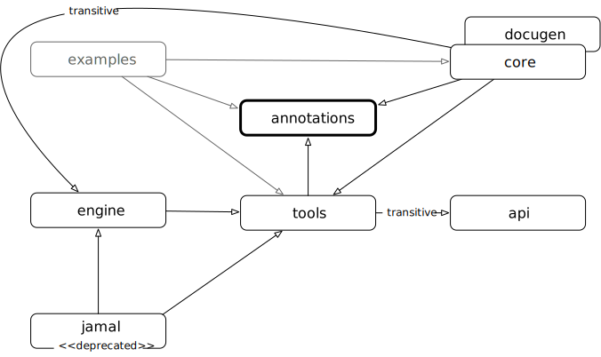

Java::Geci is a source code generation framework but it comes with some
readily available code generators. The main purpose of these generators
is to be a showcase that demonstrate how you can create your own code
generators. At the same time these generators are commercial grade tools
that you can readily use.

Using them is also a good way to get acquainted with the framework as a
first step and it also helps you understand the way how your own
generators will be used in the future.

In this chapter we will first discuss the general structure and workflow
of the framework and how to use it during development. This will include
the discussion of the library dependencies to be used, framework
configuration and also how to configure the individual generators.

Towards the second part of this chapter we will discuss the different
readily available generators that generate Java source code. We will not
discuss the snippet handling generators. These generators help to
maintain documentation and they deserve and actually get their own
chapter.

=== The modules of Java::Geci

There are several modules in Java::Geci. The most important modules are

* `api` containing the interfaces of the framework. Having the
  interfaces in a separate module keeps the code cleaner and it also
  makes possible to create other implementations that provide and use
  the same API. Although such an implementation is not likely in this
  case, still having the API separate makes the project structure
  cleaner.

* `engine` is the implementation of the framework. The classes in this
  module implement the interfaces defined in the module `api`.

* `core` module contains the sample source code generators.

* `annotations` contain a few annotation interfaces. Logically these
  interfaces belong to the API of the framework. They are in a separate
  module because these annotations, when used become a run-time
  dependency (in Maven ``compile``, default scope), while the other
  modules are all `test` scope dependencies.

* `examples` contain sample codes that use the generators and the same
  time they also serve as end-to-end tests for the generators in the
  `core` and `docugen` module.

* `docugen` contains generators that serve special purpose. They can be
  used to keep documentation up-to-date. These generators collect
  information from the source files, store them as snippets; some of
  them modify/format the snippets and finally some of them insert the
  final format into some source code, usually Markdown or JavaDoc.

* `core-annotations` contain the annotations that are generator specific
  and help to write easier-to-maintain and more readable code.

* `tools` contain auxilliary classes and methods that help the
  generators to perform their task. When using readily available
  generators you will not meet this module directly.

* `jamal` is an already deprecated module that uses the Jamal macro
  language to provide a general code generation possibility without
  Java coding. Later it was decided that the use of Jamal is an
  overkill, the tool is too complex and the generator `repeated` will
  serve the same purpose in a simpler way.



=== Maven Coordinates

When you want to use a source code generator then you have to have a
dependency on the library/module that contains the generator. In
addition to that you also need the Java::Geci engine that will execute
the generator or generators for you. In this case the generators are in
the library `com.javax0.geci:javageci-core:{javageci_version}`. The
engine is in the library
`com.javax0.geci:javageci-engine:{javageci_version}`

These are the libraries that you have to depend on in your maven
project. The scope of these dependencies are `test` because the code
generation runs from tests only and there is no, and also there should
not be any run time dependency on a development tool. The only unfortunate
exception is the annotation library, though there is also a remedy in case
you want to get rid of this dependency for the run-time.

This dependency is run-time (`compile` in maven) because code generators
use parameters of the annotations which are on the classes, fields,
method that are enriched with generated code. The code generation runs
when the unit tests run. If the code generators want to read these
annotations then these annotations have to be in the byte-code. This is
the reason why these annotations have a
`@Retention(RetentionPolicy.RUNTIME)` annotation. Even though the
production code does not rely on these annotations and does not use
these annotations they are in the production code and the JVM will not
be able to load the class unless the annotation interfaces are also
available.

The use of these annotations is optional and you can totally avoid using
annotations or you can use your own annotations. We will discuss this
possibility later.

[source,xml]
    <dependencies>
        <dependency>
            <groupId>com.javax0.geci</groupId>
            <artifactId>javageci-core</artifactId>
            <version>${javageci_version}</version>
            <scope>test</scope>
        </dependency>
        <dependency>
            <groupId>com.javax0.geci</groupId>
            <artifactId>javageci-engine</artifactId>
            <version>${javageci_version}</version>
            <scope>test</scope>
        </dependency>
        <dependency>
            <groupId>com.javax0.geci</groupId>
            <artifactId>javageci-annotation</artifactId>
            <version>${javageci_version}</version>
        </dependency>
    </dependencies>

Even though your code will use other modules, like the `api` module you
do not need to have explicit dependency on it in the pom file, because
these modules have a dependency on them.

The different modules are released synchronously.

=== Configuring the framework

To run the generator you have to create a unit test. The structure of
the unit test will look something like:

// snip book_TestAccessor snippet="TestAccessor" trim="to=0"
```java
@Test
void testAccessor() throws Exception {
    Geci geci;
    Assertions.assertFalse(
            (geci = new Geci()).source(maven().module("javageci-examples").mainSource())
                    .register(Accessor.builder().build())
                    .generate(),
            geci.failed());
}
```

This unit test is the actual code of the unit test code for the
generator accessor. It starts declaring a `Geci` object. This object is
the one that represents the framework and configures and executes the
code generations.

On the assertion line this variable get initialized and then it is
immediately configured using chained method calls. The method `source()`
defines the location of the source files. There are auxiliary static
methods and auxiliary classes that let you define the location in a
readable way. If you use the Maven directory structure, you can use the
object returned by the static method `maven()` (statically imported into
the unit test) and the method `module()` and `mainSource()` on that.
This will configure the main Java source directory of a multi-module
maven project module named `javageci-examples`.

The next configuration call is `register()` that registers a new
generator object. In this case this is an `Accessor` object, which is
created using the built-in builder. Generators usually have built-in
builders that allow the calling code to configure the instance. In this
case there is no configuration. After calling the `Accessor.builder()`
method, which returns a builder instance we call immediately the method
`build()` that returns the built object.

The final call is `generate()`. It starts the code generation. The
return value of this method is `false` if it did not generate any new
code. If there was some code generated or some already generated code
was changed and hence some source code files were modified then the
return value if `true`. In this case the unit test should fail because
it means that the source code was not up-to-date when it was compiled.

To check it the unit test uses the `assertFalse` assertion. The second
argumen to `assertFalse` is the error message. This is invoked by the
framework after the generation and the object referenced by the variable
`geci` will return a detailed error message when the method `failed()`
is called.

There are many more configuration possibilities for the generator. These
are documented in the JavaDoc of the interface `javax0.geci.api.Geci`.

=== Configuring Individual Generators

=== Using your own Annotations

=== Sample Generators

These generators are readily available. Most of them are also available
in other frameworks or the functionality is provided using the
appropriate menus of the IDE. Using these generators provide some
advantages. These are the followings.

* These generators run automatically and compilation fails if the code
  is not up-to-date. That way it is not possible to have, for example,
  `equals()` and `hashCode()` methods that do not take into account
  some of the fields introduced into the code after the last
  time the code generator executed.

* The Java class that generates the code is very simple after you get
  acquainted with the framework and it is possible to tune the actual
  generator to your specific needs.

In the following sections we list the most important sample generators.

==== Accessor Generator

The accessor (setter/getter) generator is part of Java::Geci core. It
can be used to generate setters and getters. To use it you should create
a test

// snip TestAccessor
```java
    @Test
    void testAccessor() throws Exception {
        Geci geci;
        Assertions.assertFalse(
                (geci = new Geci()).source(maven().module("javageci-examples").mainSource())
                        .register(Accessor.builder().build())
                        .generate(),
                geci.failed());
    }
```

that will generate the code during test time.

// snippet The_generator_object_passed
The generator object passed to the method `register()` is supposed to
be created using the builder built-into the generator. This is a call
to `Accessor.builder()`, then configuration method calls and finally
a call to `build()` to get the actual generator object.
// end snippet

When you use the builder to generate an instance you can define the
following parameters:


* `setterNameGenerator()` can be used to specify a
 `Function<String,String>` that converts the name of the field to the
 setter name. This can be used in case there are some specific naming
 conventions used in some of the source files. The default is to
 prepend the prefix `set` in front of the field name capitalized. That
 way `fieldName` will get the setter `setFieldName()`.

*`getterNameGenerator()` is similar but it can be used to calculate the
  name of the getter.The default is to prepend the prefix `get` in front
  of the field name capitalized. That way `fieldName` will get the
  setter `setFieldName()`.

* `getterReturnValueDecorator()` is a `Function<String,String>` that can
  be used to inject code around the getter return value. The getter by
  default has a return statement that has the format `return field;`.
  Using this function the string representing the `field` can be
  replaced with something more complex. The argument to the `apply()`
  method to the function will be the name of the field and the result of
  the function will be used between the `return` keyword and the line
  ending `;` semicolon. In other word using this function you can
  replace the `field` name string with something more complex.

* `filter` defines the filter expression matched against the fields and
  the fields that match will get a setter and a getter.
// snippet This_configuration_parameter_can_also_be_used_on_the_field_level
  This configuration parameter can also be used on the field level
  configuration using field annotations and the behaviour is detailed
  below in the list of the configuration parameters that are for the
  field level.
// end snippet

* `access` defines the access control modifier of the fields.
// snip This_configuration_parameter_can_also_be_used_on_the_field_level
  This configuration parameter can also be used on the field level
  configuration using field annotations and the behaviour is detailed
  below in the list of the configuration parameters that are for the
  field level.
//end snip

To ignite the code generation for a specific class you have to annotate
the class as

```java
@Geci("accessor ... parameters ...")
```

The mnemonic of the generator is `accessor`.

The generator is implemented as a filtered fields generator thus on the
class level you can define the `filter` parameter to specify which
fields need setters and getters.

The `editor-fold` segment identifier can also be defined using the `id`
parameter or else the value `accessor` will be used as usual, which is
the mnemonic of the generator.

The other parameters usually make sense on the field level. When not
specified on the field level they are inherited from the class
annotation of from the editor-fold parameters if defined there. The
individual fields can also be annotated with

```java
@Geci("accessor ... parameters ...")
```

Example:
```java
@Geci("accessor")
public class ExampleClass {
    @Geci("accessor getter='isTrue'")
    private boolean truth;
}
```

In this example the class is annotated to signal for the generator that
this class needs the accessor generator to generate setters and getters
but the class level annotation does not define any parameters.

The field level configuration on the field `truth` defines the name of
the getter, which will be `isTruth()`. (This parameter can only be
defined on the field level and is documented below.)

The following parameters can be used on the field level:

* `filter` can signal that the field does not need setter and getter.
  The value of the parameter in this case should be `false`. Any other
  value will also be interpreted and matched against the current field,
  but any such complexity only decreases the readability of the code.
  You can also use `filter` on the field with the value `true` if the
  global `filter` expression would otherwise exclude the field, but the
  specific field needs an accessor.

* `access` can define the access modifier of the setter and the getter.
  The default value is `public`. The value of the parameter will be used
  in front of the setters and getters. The values you can use are `public`,
  `protected`, `private` or `package`. If you use the value `package`
  then there will be no modifier inserted in front of the setter and the
  getter. The code will check that the actual value of the configuration
  parameter is nothing else but one of the above listed values and will
  throw an exception in case you misspell the modifier.

TIP: In some rare cases you may want to insert something complex like
     `public synchronized` in front of the accessors. In that case you
     can escape from the checking appending a `!` after the the modifier
     expression. That way you should write `access='public
     synchronized!'`. The code generator will remove the trailing `!`
     and will not check the syntax and the correctness of the modifier
     string. It will be inserted into the code exactly as you typed.

* `only`, this configuration parameter can have the value `setter` or
  `getter`. If it is defined only the setter or only the getter will be
  generated. You can define this parameter on the class level if all or
  most of the fields need only setters or only getters. If there are
  some fields that need both then you can specify on the field level
  `only=''` (empty string) which will not limit the generation on that
  specific field either to getter or to setter only but overrides the
  global setting.

* `id` can be defined to use a different segment for the specific field.

* `setter` can be used to define the name of the setter. If it is not
  defined then the name of the setter will be `set` and the name of the
  field with the first letter upper cased. There is no point to use this
  configuration parameter on the class level as it would cause all the
  setters to have the same name. For this reason this parameter on the
  class level, even if defined, is ignored.

* `getter` can be used to define the name of the getter. If it is not
  defined then the name of the getter will always be `get` and the name
  of the field with the first letter upper cased.


==== Builder Generator

==== Equals Generator

==== Cloner Generator

==== Fluent API Generator

==== Mapper Generator

==== Repeated Generator (a Java "preprocessor")

=== Java::Geci Domain Generators

There are two generators that were developed to generate code while
creating generators in the Java::Geci framework. These are domain
specific generators.

The configuration generator creates configuration handling code into a
generator. The annotation builder creates annotation interface for a
generator.

==== Configuration Builder

==== Annotation Builder

